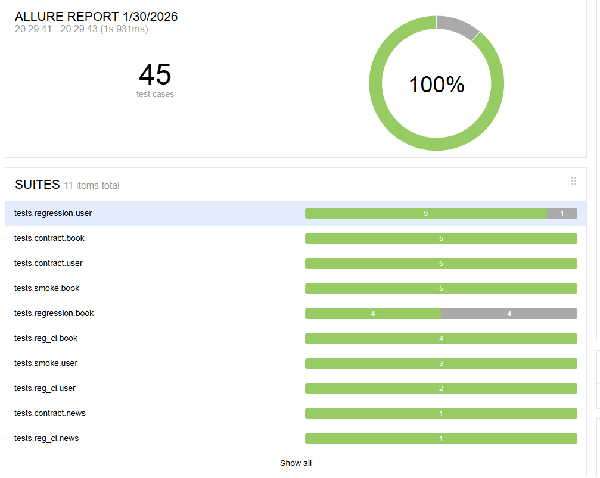

# API Automation Test Project

This project implements a **layered API automation testing strategy**
for a novel reading platform, focusing on **stability**, **contract integrity**,
and **core business regression coverage**.

The test suite is designed to reflect **real-world automation practices**
used by QA / SDET teams, rather than exhaustive endpoint coverage.

---
## Test Reporting (Allure)

---

## 1. Testing Goals

- Verify core APIs are **reachable and stable**
- Protect API **response contracts** from breaking changes
- Detect **critical business regressions** across key user flows
- Keep the suite **fast, reliable, and CI-friendly**

---

## 2. Testing Layers Overview

| Layer      | Purpose                               | Characteristics |
|-----------|---------------------------------------|----------------|
| Smoke     | Service availability check            | Fast, read-only, minimal assertions |
| Contract  | API response structure validation     | Schema-based, P0 endpoints only |
| Regression| Business behavior & state invariants  | Cross-API flows, negative paths, boundary conditions |

---

## 3. Smoke Test Scope

**Principles**
- Stable and fast
- Prefer read-only APIs
- No complex business dependencies

### Included Smoke APIs

- `GET /book/listBookCategory`
- `GET /book/queryBookDetail/{bookId}`
- `GET /book/queryIndexList?bookId=`
- `GET /news/listIndexNews`
- `GET /book/listRank`
- `POST /user/login`
- `GET /user/userInfo`
- `GET /book/searchByPage`

> Smoke tests validate basic availability and response success,
> without enforcing detailed schema or business logic.

---

## 4. Contract Test Scope (Schema Validation)
**Principles:** 
- P0 externally consumed APIs, focus on structure integrity.
- Endpoint-level schemas


### 4.1 Schema Modularization & Reuse (Key Architecture)
To ensure **DRY (Don't Repeat Yourself)** principles and high maintainability, the project uses a modular schema composition strategy:

* **`BASE_RESPONSE_SCHEMA`** (`base_response.py`): The universal "envelope" for all responses, defining `code`, `ok`, `msg`, and `data`.
* **`pagination_schema()`** (`common_pagination.py`): A high-order function that wraps business models into a standard pagination structure,
including `pageNum`, `pageSize`, `total`, `list`, and `pages`.


### Covered Contract APIs

- `GET /book/listBookCategory`
- `GET /book/listRank`
- `GET /book/queryBookDetail/{bookId}`
- `GET /book/queryIndexList`
- `GET /book/searchByPage`
- `GET /news/listIndexNews`
- `POST /user/login` (token schema)
- `GET /user/userInfo`
- `GET /user/listBookShelfByPage`
- `GET /user/queryIsInShelf`

These tests ensure:
- Required fields exist
- Field types remain compatible
- Pagination structures do not break consumers

---
## 5. CI Regression Suite (Fast, Deterministic, P0 Coverage)

The **CI Regression suite** is a **minimal, deterministic subset of regression tests**
designed to run on **every CI execution**.

Its purpose is to:
- Validate **P0 business-critical paths**
- Catch **high-impact regressions early**
- Remain **fast, stable, and environment-safe**

This suite intentionally avoids:
- Large data setup
- Non-deterministic dependencies
- Full combinatorial coverage

---

### CI Regression Coverage

The following tests validate **core system health** and **critical user flows**:

- **`test_book_category_ci`** — Book category API availability and basic data sanity.
- **`test_book_detail_ci`** — Book detail retrieval and identity consistency by `bookId`.
- **`test_book_index_list_ci`** — Chapter index list accessibility and structure integrity.
- **`test_book_rank_ci`** — Ranking list availability for discovery flows.
- **`test_index_news_ci`** — Homepage news feed availability and display readiness.
- **`test_user_login_ci`** — Authentication and token usability for authorized APIs.
- **`test_user_bookshelf_ci`** — Bookshelf lifecycle state consistency  
  *(Add → Query True → Remove → Query False)*.


---

## 6. Regression Test Plan 

Regression tests focus on **business-critical flows**
and **cross-API consistency**, rather than field-level assertions.

Failure regression tests target **high-risk and high-frequency error paths**, instead of enumerating all possible invalid combinations.

Regression tests are designed using:
- Scenario-based testing
- Equivalence partitioning
- Boundary value analysis
- Error guessing based on common production risks

---

### 6.1 Happy Path (Core Business Flows with Scenario-Based Testing)

#### Authentication
- `login → userInfo` (token validity)
- `login → refreshToken → userInfo` (token refresh)

#### Bookshelf State Flow
- `addToBookShelf`
→ `queryIsInShelf == true`
→ `listBookShelfByPage` contains book
→ `removeFromBookShelf`
→ `queryIsInShelf == false`

#### Bookshelf Idempotency Rule (Regression Invariant)

- `addToBookShelf` (first call)
→ `addToBookShelf` (duplicate call)
→ `listBookShelfByPage` contains the book **only once** (no duplicates)

Covered Tests:
- `test_reg_addToBookShelf_idempotent_should_not_duplicate`


#### Bookshelf Cross-API Consistency (Known Issue)
Scenario:
- `addToBookShelf` with a **non-existent bookId**
- `queryIsInShelf` returns `true`
- `listBookShelfByPage` does not display the book

Expected invariant:
- If `queryIsInShelf == true`, the book must appear in `listBookShelfByPage`
  **OR**
- `addToBookShelf` should reject a non-existent `bookId`

Covered test:
- `test_reg_bookshelf_consistency_nonexistent_bookId_query_true_but_not_in_list` (`xfail`)

#### Book Data Consistency
- `searchByPage` → `queryBookDetail(bookId)`
- `queryBookDetail(bookId)` → `queryIndexList(bookId)`
- All items reference the same `bookId`

#### Comment Flow
- `addBookComment` (unique content)
- `listCommentByPage` contains the new comment

---


### 6.2 Negative Path (Validation, Boundary, Security)

#### A. Equivalence Partitioning (Data Validity)

**Endpoint:** `GET /book/queryBookDetail/{bookId}`

- Valid & exists  
  Covered by scenario-based regression tests.

- Valid but non-existent  
  Expected: JSON error response (`HTTP 404` or `code != 200`).

- Invalid format (e.g. `-1`, `"abc"`)  
  Expected: JSON validation error (`HTTP 400` or `code != 200`).

> Note: Observed deviations from these expectations are documented in **Known Issues**.

---

#### B. Boundary Value Analysis (Pagination)

**Endpoint:** `GET /book/searchByPage`

- `pageNum = 0` (invalid lower boundary)  
  Expected: rejected or normalized to `pageNum >= 1` (no `5xx`).

- `pageNum = 2` (valid just-inside value)  
  Expected: handled normally; empty list acceptable.

- `pageNum = 1` (default valid)  
  Covered by happy-path regression flows.

- `pageSize = 1` (minimum valid boundary)  
  Expected: success; result size ≤ 1; pagination metadata consistent.

---

### C. Error Guessing (Security & Missing Params)

Based on experience with similar systems, error-guessing tests focus on **high-risk but
commonly overlooked scenarios**.

- **login invalid password**
  - Scenario: submit valid username with incorrect password.
  - Expected: authentication fails gracefully (`ok=false` / `code!=200`), no token returne
  
---
## 7. Out-of-Scope APIs

The following APIs are intentionally excluded from regression testing:

- **Payment APIs** (`/pay/*`)
  - External gateway dependency
  - Asynchronous callbacks
  - Risk of flaky tests
- **Author / CMS APIs**
  - Do not affect core reader user flow
  - Higher change frequency

Optional mock-based payment tests may be added in a separate suite.

---
## 8. Known Issues & Observed Contract Deviations

The following behaviors are **observed during regression testing**.  
They are explicitly marked using `pytest.xfail` to preserve test intent while keeping CI results stable.

### 1) Non-existent Book ID Error Handling
- **Endpoint:** `GET /book/queryBookDetail/{bookId}`
- **Observed Behavior:** Returns an HTML "Not Found" page
- **Impact:** API contract violation for JSON consumers
- **Status:** `xfail`

### 2) Invalid `bookId` Parameter Handling
- **Endpoint:** `GET /book/queryBookDetail/{bookId}`
- **Inputs:** `-1`, `"abc"`
- **Observed Behavior:** HTML error response
- **Impact:** Contract inconsistency
- **Status:** `xfail`

### 3) Pagination Boundary Handling (`pageNum = 0`)
- **Endpoint:** `GET /book/searchByPage`
- **Observed Behavior:** Accepted as valid, returns empty list with `ok=true`
- **Impact:** Boundary rule violation
- **Status:** `xfail`

### 4) Bookshelf Cross-API Consistency with Non-existent `bookId`
- **Observed Behavior:**  
  `queryIsInShelf == true` but `listBookShelfByPage` does not include the book
- **Impact:** Business contract inconsistency
- **Status:** `xfail`

### 5) Token Refresh Behavior (Observed Contract)
- **Behavior:** `/user/refreshToken` issues a new token without revoking previously issued tokens
- **Note:** Old tokens remain valid until natural expiration
- **Impact:** Documented authentication contract (not a test failure)

---
## 9. Test Execution

```bash
# Run smoke tests
pytest tests/smoke

# Run contract tests
pytest tests/contract

# Run regression tests
pytest tests/regression

# Run CI regression suite (P0 only)
pytest tests/reg_ci